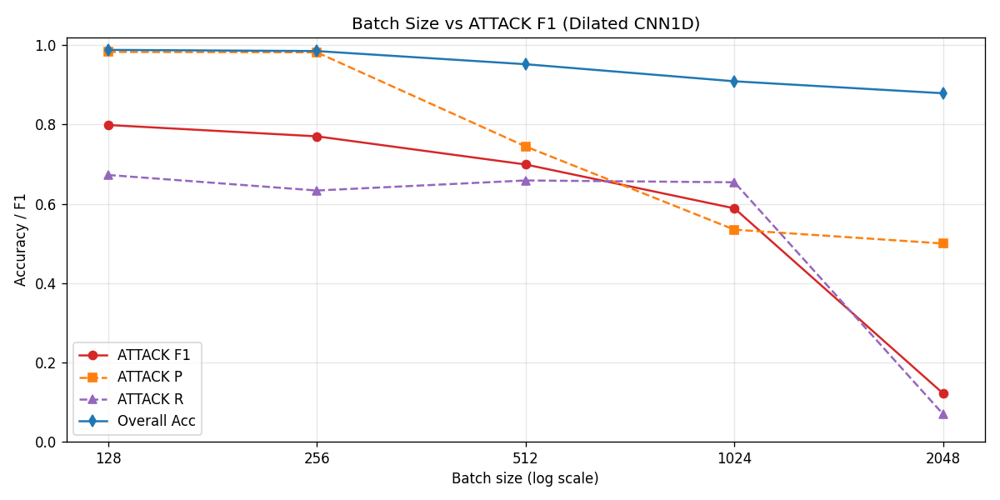
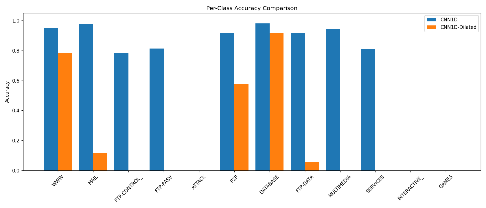

<p align="right">
  <b>日本語</b> | <a href="README.en.md">English</a>
</p>

# CNN ベースのネットワークトラフィック分類

インターネット上を流れている通信データを見て、それが「普通の Web 閲覧」なのか、「メール送受信」なのか、それとも「サイバー攻撃」なのかを、AI (ディープラーニング) で自動的に見分けるシステムです。

---

## このプロジェクトは何をするものか

ネットワーク上には毎秒、膨大な数の通信パケットが流れています。その一部は YouTube を見ている人、一部はメールを送っている人、そして一部は外部からの攻撃です。これらを高速かつ正確に区別できれば、ファイアウォールや不正侵入検知システムの精度を上げることができます。

本プロジェクトでは:

- 通信の中身 (暗号化された HTTPS の内容など) は一切見ずに、
- 「1 秒間に何個パケットが来たか」「パケットの平均サイズはどれくらいか」「TCP の特定フラグが何回立ったか」 など、表面的な統計量 248 種類だけを使い、
- 通信を 12 種類のカテゴリ (Web、メール、ファイル転送、データベース、攻撃トラフィック 等) に自動分類するモデル

を作りました。中身を見ないので、通信が暗号化されていても、ユーザのプライバシーに踏み込めない状況でも動作するという利点があります。

---

## リポジトリの 2 つの段階

1. **2022 年の学部卒業研究を 4 年後に自分で再現**
   当時の TensorFlow ベースの実装を読み直しながら、CNN を含む 6 種類のアルゴリズム比較を再構築しました。再現作業中に、当時の前処理コードに紛れていたバグ — 文字列の一括置換によってクラス名 `FTP-CONTROL` と `INTERACTIVE` の中の `N` まで書き換えてしまい、これら 2 クラスのサンプルが学習データから完全に欠落する不具合 — も発見・修正しています。

2. **改善を加えた拡張版**
   PyTorch + GPU 環境への移行を起点に、「表形式の特徴量を 16×16 の画像のように扱う 2D CNN は構造的に不自然なのではないか」という仮説の検証から始め、1D CNN・Dilated 畳み込み・Focal Loss・二段階分類器・派生特徴量・バッチサイズの系統的検証など、合計十数通りの構成を比較しました。

---

## 主な成果

原論文の改良版モデル (filters 16/32, batch 64) を、同一の評価パイプラインで公平に再実装したうえで、提案手法はこれを上回りました。

- **全体精度**: 99.08% → **99.12%**
- **攻撃検知の F1 スコア**: 81.32% → **82.64%**
- **攻撃検知の Precision (誤検知の少なさ)**: 95.64% → **99.35%**

特に Precision 99.35% は、「普通の通信を誤って攻撃と判定する確率がほぼゼロに近い」という意味であり、セキュリティ製品の実用性の観点では F1 の改善幅以上に重要だと考えています。

---

## 検証を通じて得た一番の発見

Focal Loss、二段階分類器、サンプル数の人工的な水増しなど、「いかにも効きそうな」手法をいくつも試しましたが、いずれもベースラインに対して意味のある改善を示しませんでした。代わりに最も効果的だったのは、**ミニバッチサイズという地味な学習設定を 2048 から 128 に下げるだけの、たった 1 行の変更**です。

複雑な手法に手を伸ばす前に、まず基本的なベースラインの本当の上限を測るべきだ — という教訓を、4 年越しに自分のコードから学び直すことになりました。

---

## 結果サマリー

公平な比較のため、原論文の構成と本リポジトリの提案手法を、同一の PyTorch + GPU パイプラインで再評価しました。

| 構成 | Batch | Overall | ATTACK Precision | ATTACK F1 | 時間 |
|------|------:|--------:|----------------:|----------:|-----:|
| 原論文 2D CNN (filters 8/16) | 128 | 98.53% | 88.44% | 78.46% | 38.4s |
| 原論文 Section 5.2 改良版 (filters 16/32) | 64 | 99.08% | 95.64% | 81.32% | 76.6s |
| 本リポジトリ: Dilated 1D CNN | 128 | 98.30% | 91.54% | 79.22% | 43.7s |
| **本リポジトリ: Dilated 1D CNN** | **64** | **99.12%** | **99.35%** | **82.64%** | 89.0s |

Dilated 1D CNN (batch 64) は、原論文の最良構成と比べて、Overall +0.04 / ATTACK Precision +3.71 / ATTACK F1 +1.32 ポイントの改善となりました。とりわけ ATTACK Precision 99.35% は、誤検知が極めて少ないという点で運用上の意味が大きいと考えています。

バッチサイズと ATTACK F1 の関係 (本検証で最も興味深かった単調曲線):



クラス別の精度比較:



他のグラフ (アルゴリズム比較、混同行列、学習曲線): [docs/](docs/)

---

## 動かし方

```bash
pip install -r requirements.txt

# Moore データセットを data/moore/ に置いてください (詳しくは USAGE.md)
# Cambridge 公式: https://www.cl.cam.ac.uk/research/srg/netos/projects/archive/nprobe/data/papers/sigmetrics/

python main.py --all                              # 元論文の 6 アルゴリズム比較を再現
python batch_sweep.py --epochs 25 --batches 128   # おすすめの最終構成 (GPU 推奨)
```

詳しい実行手順は [USAGE.md](USAGE.md) を、各改善実験の動機・実装・結果は [EXPERIMENTS.md](EXPERIMENTS.md) を見てください。

---

## ファイル構成

```
final/
├── README.md / README.en.md / USAGE.md / EXPERIMENTS.md
├── config.py                  -- 全体の設定
├── data_preprocess.py         -- Moore データの読み込みとクラスバランス調整
├── feature_engineering.py     -- 特徴量の並べ替え、ATTACK 向けの派生特徴
├── models_dl.py               -- TF/Keras: 元論文の CNN, BP
├── models_ml.py               -- sklearn: KNN, NB, SVM, DT
├── models_torch.py            -- PyTorch GPU: CNN/CNN1D/Dilated + Focal Loss
├── utils_eval.py              -- 混同行列・学習曲線・比較プロット
├── main.py                    -- 6 アルゴリズム比較のエントリーポイント
├── ablation.py                -- 1D vs 2D、Dilated、reorder の ablation
├── attack_experiments.py      -- ATTACK クラス専用の 6 つの試み
├── batch_sweep.py             -- バッチサイズの系統的スイープ
└── data/moore/  outputs/      -- データと出力 (gitignore 対象)
```

---

## 主な発見 (3 行で)

1. **2D reshape は意味のない近傍を作ってしまう** — 248 個の統計量を 16×16 に並べても、それは画像ではありません。1D Conv の方が自然です。
2. **小さなモデル + 不均衡データではバッチサイズが一番効く** — Focal Loss、Two-Stage、SMOTE、class weight などを色々と試しましたが、batch を 2048 から 128 に下げる 1 行の変更が一番効きました。
3. **特徴量を強調すると逆効果になることがある** — ATTACK 検知のためにポート関連の特徴を強調したら、Precision が下がってしまいました。攻撃側はポートを偽装することが多いので、ポートを重視すると逆に騙されやすくなります。

詳しい話は [EXPERIMENTS.md](EXPERIMENTS.md) を見てください。

---

## 背景

これは王世元の学部卒業研究 (2022 年) を、4 年後に自分で再現して書き直したプロジェクトです。

データセット: Moore Dataset (A. Moore et al., University of Cambridge, 2005)

---

## 引用

```bibtex
@misc{wang2022cnn,
  author = {Wang, Shiyuan},
  title  = {CNN-based Network Traffic Classification},
  year   = {2022},
}

@inproceedings{moore2005identification,
  author    = {Moore, Andrew W. and Papagiannaki, Konstantina},
  title     = {Toward the accurate identification of network applications},
  booktitle = {PAM},
  year      = {2005},
}
```

---

*Last updated: 2026-05*
