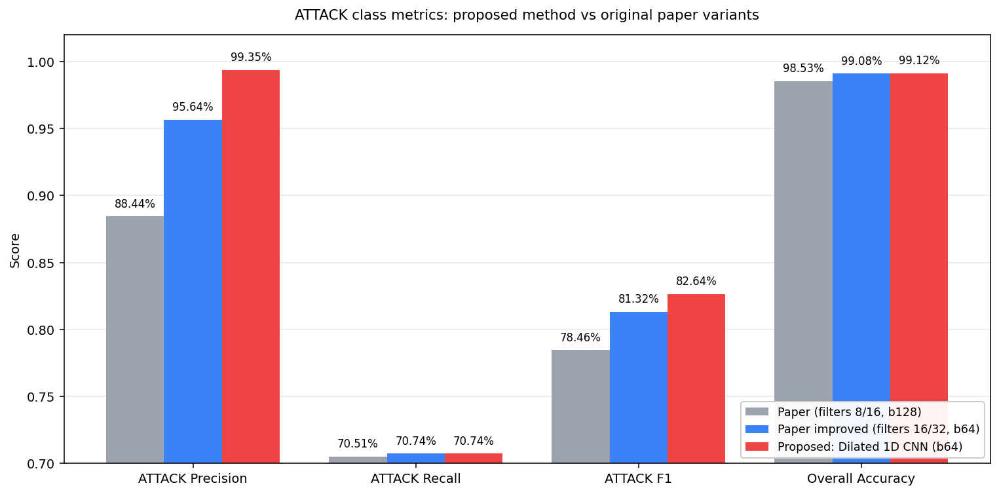

<p align="right">
  <b>日本語</b> | <a href="README.en.md">English</a>
</p>

# CNN ベースのネットワークトラフィック分類

このプロジェクトでは、ネットワーク上を流れている通信を、Web 閲覧・メール・ファイル転送・サイバー攻撃など 12 種類のカテゴリに、CNN (畳み込みニューラルネットワーク) を使って自動的に分類するモデルを作りました。通信の中身そのもの (例えば暗号化された HTTPS の中身) は一切覗かず、「1 秒間に何パケット流れたか」「パケットの平均サイズはどれくらいか」「TCP の特定フラグが何回立ったか」といった表面的な統計量だけを使って判定します。

## なぜこのプロジェクトを作ったのか

家庭用ルーターから企業のファイアウォールまで、ネットワーク機器は長らく「ポート番号」を頼りに通信を分類してきました。SMTP は 25 番、HTTPS は 443 番、というふうにです。しかしこのやり方は、現代のインターネットではほとんど通用しません。

- P2P アプリや VoIP、オンラインゲームなどは動的にポートを切り替えるので、固定ルールでは追跡できない
- 攻撃者は正規のポート (80 や 443) をわざと使うことで、簡単にすり抜けられる
- HTTPS が一般化した結果、パケットの中身を見る Deep Packet Inspection (DPI) も限定的な状況でしか使えない

つまり、ポートと固定ルールに基づく従来のトラフィック分類は、もはや有効性の面でも安全性の面でも限界に来ています。本プロジェクトは、ルールの代わりに「通信のふるまい (統計的な特徴)」から機械学習で識別するアプローチが、どこまで通用するかを検証したものです。中身を見ないので、通信が暗号化されていても、ユーザのプライバシーに踏み込めない状況でも動作します。

## ベースになっているのは、4 年前の自分の卒業研究です

このリポジトリは、私が **2022 年に北京情報科技大学で書いた自身の学部卒業研究** (王世元 著「基于 CNN 的网络数据流量分类」) を出発点にしています。当時取り組んだ内容は次のとおりです。

- データセット: Cambridge 大学が公開している **Moore Dataset** (約 25 万件のラベル付き通信フロー、12 クラス)
- 入力: 各通信フローから抽出した 248 次元の統計特徴量
- 比較した手法: **CNN** (2D, 16×16 に reshape して入力)、BP 神経網、KNN、Naive Bayes、SVM、Decision Tree の合計 6 種類
- 主な結論: CNN が最も高精度 (Overall 99.58%) で、効率面でも他の機械学習手法より優れる
- 残された課題: **攻撃トラフィック (ATTACK) クラスの認識精度が ~70% で頭打ち**。「攻撃側が正規ポートに偽装するため、特徴量設計の根本的見直しが必要」と論文に書き残した

それから 4 年後、改めて自分のコードを読み返したとき、次の 2 つを検証したくなりました。

1. 当時の結論は本当に正しかったのか? 自分が気付いていなかった設計上の問題はなかったか?
2. 現在のフレームワーク (PyTorch + GPU) と、その後一般化した技術 (1D CNN、Dilated 畳み込み、Focal Loss など) を使えば、当時諦めた ATTACK クラスの精度をさらに伸ばせるのではないか?

この再検証と拡張の記録が、本リポジトリです。

## やったこと

4 段階に分けて取り組みました。

### 1. 4 年前の自分のコードを、今のスタックで動かし直す

当時 TensorFlow + Keras + Python 3.9 で書いた実装を、Python 3.12 / TensorFlow 2.21 で動くように移植したうえで、6 種類のアルゴリズム比較を再実行しました。再現してみると、当時の自分のラベル前処理に「`N` の一括置換が、クラス名 `FTP-CONTROL` と `INTERACTIVE` の中の `N` まで書き換え、これら 2 クラスのサンプルが完全に欠落する」という不具合が紛れていたことに気付き、修正しました。プロジェクトは、4 年前の自分が見落とした地味なバグを、自分で見つけて潰す作業から始まりました。

### 2. 「表データを擬似画像にする」設計を疑う

原論文では 248 次元の統計特徴量を 16×16 の擬似画像に整形して 2D CNN に入力していました。ただ、この 248 次元の列同士は意味的に独立した統計量なので、2D 畳み込みが取る「上下左右の近傍」はほとんど偶然です。試しに同じ表現を 1D CNN で扱ったところ精度が改善し、特に学習サンプルが少ないクラス (FTP-PASV, INTERACTIVE_ など) で +3〜4 ポイント程度伸びました。

### 3. Dilated 1D CNN で受容野を拡げる

通常の 1D Conv1D のカーネルが見ている範囲はわずか 5 セル程度ですが、これを Dilated 畳み込みに置き換えることで実効受容野を 15 セル相当まで広げました。最初の試行 (Global Average Pooling 採用) では情報が均されすぎて精度 82% まで落ち、Max Pooling に置き換えて 99% 台へ復帰させるという回り道もありましたが、最終的にはこの構成が原論文の最良構成を上回りました。

### 4. 攻撃クラスの精度を上げる方法を系統的に試す

ATTACK クラスは全体の 1% 程度しかない少数派で、原論文でも認識精度の低さが残された課題でした。Focal Loss、二段階分類器、SMOTE 的な合成サンプル、ポート特徴量の派生設計、バッチサイズの系統的検証など、合計十数通りの方策を比較しました。結果として最も効いたのは「バッチサイズを 2048 から 128 に下げる」というたった 1 行の変更で、凝った手法はいずれもベースラインを超えませんでした。

## 結果

公平な比較のため、原論文の構成と提案手法を同じ PyTorch + GPU パイプラインで再評価しました。

| 構成 | Batch | Overall | ATTACK Precision | ATTACK F1 | 時間 |
|------|------:|--------:|----------------:|----------:|-----:|
| 原論文 2D CNN (filters 8/16) | 128 | 98.53% | 88.44% | 78.46% | 38.4s |
| 原論文 Section 5.2 改良版 (filters 16/32) | 64 | 99.08% | 95.64% | 81.32% | 76.6s |
| **提案: Dilated 1D CNN** | 64 | **99.12%** | **99.35%** | **82.64%** | 89.0s |

提案手法は原論文の最良構成を、Overall・Precision・F1 のすべてで上回りました。



特に攻撃検知の Precision 99.35% は、「正常な通信を攻撃と誤判定する確率がほぼゼロ」を意味しており、セキュリティ製品としての実用性に直結する数字だと考えています。


上の図は、攻撃検知 F1 がバッチサイズに対してどう変化するかを示したものです。バッチを小さくするほど性能が単調に向上する — というのは、本検証で最も意外だった発見でした。Focal Loss や二段階分類のような「いかにも効きそうな」手法をいくつ試しても上がらなかった F1 が、「バッチサイズを下げる」たった 1 行の変更で改善するという、教科書的な教訓を 4 年越しに自分のコードから学び直すことになりました。

## 動かし方

```bash
pip install -r requirements.txt
# Moore データセットを data/moore/ に配置 (詳細は USAGE.md)

python main.py --all                            # 6 アルゴリズム比較を再現
python batch_sweep.py --epochs 25 --batches 128 # 推奨最終構成 (GPU 推奨)
```

詳しい実行手順は [USAGE.md](USAGE.md) を、各改善実験の動機・実装・結果は [EXPERIMENTS.md](EXPERIMENTS.md) を参照してください。

## データセット

実験には Cambridge 大学が公開している Moore Dataset (A. Moore et al., 2005) を使用しています。10 個の ARFF ファイルからなる、約 25 万件のラベル付き通信フローです。ダウンロード手順は [USAGE.md](USAGE.md) に書きました。

## 引用

```bibtex
@misc{wang2022cnn,
  author = {Wang, Shiyuan},
  title  = {CNN-based Network Traffic Classification},
  year   = {2022},
}

@inproceedings{moore2005identification,
  author    = {Moore, Andrew W. and Papagiannaki, Konstantina},
  title     = {Toward the accurate identification of network applications},
  booktitle = {PAM},
  year      = {2005},
}
```
